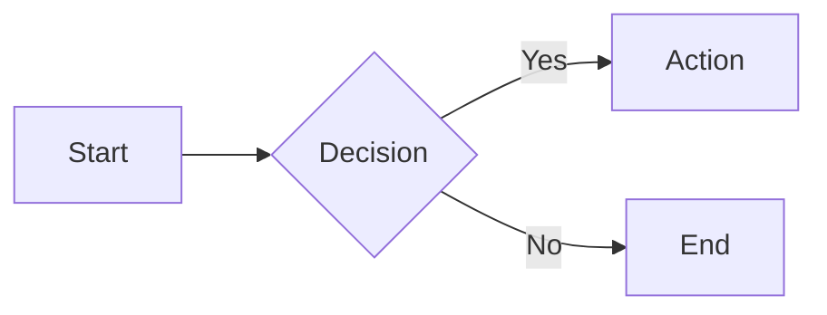

# MkDocs Documentation Setup Plan


This plan provides step-by-step instructions for setting up MkDocs-based documentation with Material theme and mkdocstrings (API documentation from docstrings) for any Python project that uses the `uv` package manager. The setup includes auto-generated API documentation, live preview server, and Makefile integration.

## 1. Requirements & Constraints

### Requirements

- **REQ-100**: Documentation must be written in Markdown (native MkDocs format)
- **REQ-200**: API documentation must be auto-generated from Python docstrings
- **REQ-300**: Documentation must build to HTML format
- **REQ-400**: Build commands must use `uv run` to ensure correct virtual environment
- **REQ-500**: The setup must work with any uv-managed Python project
- **REQ-600**: A `make docs` command must be available from the project root
- **REQ-700**: A live preview server must be available for development

### Constraints

- **CON-100**: The target project must have a `pyproject.toml` file (required for uv)
- **CON-200**: This plan supports flat package layout (`<project-root>/<package-name>/`); src-layout projects must adjust paths as noted
- **CON-300**: This plan does not include CI/GitHub Actions configuration
- **CON-400**: This plan does not include the project's Python package itself; only documentation infrastructure
- **CON-500**: MkDocs does not support man page generation (use Sphinx if man pages are required)

### Guidelines

- **GUD-100**: All paths in this plan use placeholders: `<project-root>` for the project directory, `<package-name>` for the Python package name
- **GUD-200**: Replace placeholder values (marked with `<...>`) with actual project-specific values during implementation
- **GUD-300**: The HTML theme (Material for MkDocs) can be swapped for alternatives (ReadTheDocs, MkDocs default) by changing `theme.name` in `mkdocs.yml` and updating dependencies
- **GUD-400**: If using a `src/` layout, adjust the `paths` option from `[.]` to `[src]` in the mkdocstrings handler configuration

## 2. Implementation Steps

> **Before you begin:** Ensure your git working directory is clean so you can easily revert if needed:
> ```bash
> git status        # Should show no uncommitted changes
> git stash         # If needed, stash current work
> ```
> If something goes wrong, you can revert all changes with `git checkout -- .` or `git stash pop` to restore your stashed work.

### Prerequisites Checklist

Before starting implementation, verify these prerequisites:

- [ ] `uv` is installed: `uv --version`
- [ ] Project has `pyproject.toml`: `ls pyproject.toml`
- [ ] Python package exists and is importable: `uv run python -c 'import <package-name>'`
- [ ] GNU Make is available: `make --version`
- [ ] Git repository is initialized: `git status`


### Phase 1: Add Documentation Dependencies

> **IMPORTANT:** Before implementing this phase, review the Constraints and Decisions sections for applicable items.

- **GOAL-100**: Add all required documentation dependencies to the project

| Task | Description | Completed | Date |
|------|-------------|-----------|------|
| TASK-0100 | Open `<project-root>/pyproject.toml` and locate the `[dependency-groups]` section | | |
| TASK-0200 | Add a `docs` dependency group containing: `mkdocs>=1.6`, `mkdocs-material>=9.5`, `mkdocstrings[python]>=0.27` | | |
| TASK-0300 | Run `uv sync --group docs` to install the documentation dependencies | | |
| TASK-0400 | Verify installation by running `uv run mkdocs --version` | | |

#### Dependency Group Configuration

Add the following to `pyproject.toml`:

```toml
[dependency-groups]
docs = [
    "mkdocs>=1.6",
    "mkdocs-material>=9.5",
    "mkdocstrings[python]>=0.27",
]
```

#### Phase 1 Results

| Metric | Expected | Actual | Status |
|--------|----------|--------|--------|
| mkdocs version output | Version 1.6.x or higher | | |

---

### Phase 2: Create Documentation Directory Structure

> **IMPORTANT:** Before implementing this phase, review the Constraints and Decisions sections for applicable items. See DEC-0100.

- **GOAL-200**: Create the directory structure for documentation source files

| Task | Description | Completed | Date |
|------|-------------|-----------|------|
| TASK-0500 | Create directory `<project-root>/doc/source/` | | |
| TASK-0600 | Create directory `<project-root>/doc/html/` (will hold generated output) | | |
| TASK-0700 | Verify structure exists: `doc/`, `doc/source/`, `doc/html/` | | |

#### Phase 2 Results

| Metric | Expected | Actual | Status |
|--------|----------|--------|--------|
| Directory structure created | All directories exist | | |

---

### Phase 3: Create MkDocs Configuration

> **IMPORTANT:** Before implementing this phase, review the Constraints and Decisions sections for applicable items. See DEC-0200, DEC-0300, DEC-0400, DEC-0500.

- **GOAL-300**: Create the MkDocs configuration file with all required settings

| Task | Description | Completed | Date |
|------|-------------|-----------|------|
| TASK-0800 | Create `<project-root>/mkdocs.yml` with site metadata: `site_name`, `site_description`, `site_author` | | |
| TASK-0900 | Add `docs_dir: doc/source` and `site_dir: doc/html` to configure directory paths | | |
| TASK-1000 | Add Material theme configuration with `theme.name: material` and desired features | | |
| TASK-1100 | Add `plugins` section with `search` and `mkdocstrings` plugins configured | | |
| TASK-1200 | Configure mkdocstrings Python handler with `paths: [.]` and docstring options | | |
| TASK-1300 | Add `markdown_extensions` for enhanced Markdown features (admonitions, code highlighting, etc.) | | |
| TASK-1400 | Add initial `nav` structure with at least `index.md` and `api.md` entries | | |

#### Configuration Template

Create `<project-root>/mkdocs.yml`:

```yaml
# MkDocs Configuration for <package-name>
# Documentation: https://www.mkdocs.org/user-guide/configuration/

# === Site Metadata ===
site_name: "<package-name>"
site_description: "Documentation for <package-name>"
site_author: "<author-name>"
# site_url: "https://<username>.github.io/<repo-name>/"  # Uncomment for deployment

# === Directory Configuration ===
docs_dir: doc/source
site_dir: doc/html

# === Repository Information (optional) ===
# repo_name: "<username>/<repo-name>"
# repo_url: "https://github.com/<username>/<repo-name>"
# edit_uri: "edit/main/doc/source/"

# === Theme Configuration ===
theme:
  name: material
  features:
    - navigation.tabs
    - navigation.sections
    - navigation.expand
    - navigation.top
    - search.suggest
    - search.highlight
    - content.code.copy
    - content.code.annotate
  palette:
    # Light mode
    - media: "(prefers-color-scheme: light)"
      scheme: default
      primary: indigo
      accent: indigo
      toggle:
        icon: material/brightness-7
        name: Switch to dark mode
    # Dark mode
    - media: "(prefers-color-scheme: dark)"
      scheme: slate
      primary: indigo
      accent: indigo
      toggle:
        icon: material/brightness-4
        name: Switch to light mode

# === Plugins ===
plugins:
  - search:
      lang: en
  - mkdocstrings:
      default_handler: python
      handlers:
        python:
          paths: [.]  # Look for packages in project root
          options:
            # Docstring options
            docstring_style: google
            docstring_section_style: table
            show_docstring_attributes: true
            show_docstring_functions: true
            show_docstring_classes: true
            show_docstring_modules: true
            show_docstring_description: true
            show_docstring_examples: true
            show_docstring_parameters: true
            show_docstring_returns: true
            show_docstring_raises: true
            show_docstring_yields: true
            merge_init_into_class: true
            # Member options
            members_order: source
            show_submodules: true
            # Heading options
            show_root_heading: true
            show_root_full_path: true
            show_symbol_type_heading: true
            show_symbol_type_toc: true
            heading_level: 2
            # Signature options
            show_signature: true
            show_signature_annotations: true
            separate_signature: true
            # Source options
            show_source: true
            show_bases: true

# === Markdown Extensions ===
markdown_extensions:
  # Python Markdown built-in extensions
  - toc:
      permalink: true
      toc_depth: 3
  - tables
  - fenced_code
  - footnotes
  - attr_list
  - def_list
  - md_in_html

  # PyMdown Extensions (bundled with mkdocs-material)
  - admonition
  - pymdownx.details
  - pymdownx.superfences:
      custom_fences:
        - name: mermaid
          class: mermaid
          format: !!python/name:pymdownx.superfences.fence_code_format
  - pymdownx.highlight:
      anchor_linenums: true
      line_spans: __span
      pygments_lang_class: true
  - pymdownx.inlinehilite
  - pymdownx.snippets
  - pymdownx.tabbed:
      alternate_style: true
  - pymdownx.tasklist:
      custom_checkbox: true
  - pymdownx.emoji:
      emoji_index: !!python/name:material.extensions.emoji.twemoji
      emoji_generator: !!python/name:material.extensions.emoji.to_svg

# === Navigation ===
nav:
  - Home: index.md
  - API Reference: api.md

# === Extra Configuration ===
extra:
  social: []
  # generator: false  # Uncomment to hide "Made with Material for MkDocs"
```

#### Phase 3 Results

| Metric | Expected | Actual | Status |
|--------|----------|--------|--------|
| mkdocs.yml syntax valid | YAML parses without error | | |

---

### Phase 4: Create Starter Documentation Pages

> **IMPORTANT:** Before implementing this phase, review the Constraints and Decisions sections for applicable items. See DEC-0600.

- **GOAL-400**: Create minimal documentation pages to verify the setup works

| Task | Description | Completed | Date |
|------|-------------|-----------|------|
| TASK-1500 | Create `<project-root>/doc/source/index.md` with project title, description, and feature overview | | |
| TASK-1600 | Create `<project-root>/doc/source/api.md` with mkdocstrings autodoc directive for the main package | | |
| TASK-1700 | Verify both files exist and have valid Markdown syntax | | |

#### Index Page Template

Create `<project-root>/doc/source/index.md`:

```markdown
# <package-name>

Welcome to the documentation for **<package-name>**.

## Overview

<Brief description of the project and its purpose.>

## Features

- Feature 1
- Feature 2
- Feature 3

## Quick Start

<Brief getting started instructions or link to installation guide.>

## Documentation

- [API Reference](api.md) - Complete API documentation

## License

<License information>
```

#### API Reference Page Template

Create `<project-root>/doc/source/api.md`:

```markdown
# API Reference

This section contains the complete API documentation for **<package-name>**, auto-generated from source code docstrings.

## Package Overview

::: <package-name>
    options:
      show_root_heading: true
      show_source: false
      members_order: alphabetical
```

#### Suggested Additional Pages

The following pages are commonly useful but not required for the initial setup. Add them to the `nav` section in `mkdocs.yml` as needed:

- `installation.md` - How to install the package
- `usage.md` - Usage guide and examples
- `configuration.md` - Configuration options
- `changelog.md` - Version history and release notes
- `contributing.md` - Guidelines for contributors
- `faq.md` - Frequently asked questions

#### Phase 4 Results

| Metric | Expected | Actual | Status |
|--------|----------|--------|--------|
| index.md exists | File present with content | | |
| api.md exists | File present with autodoc directive | | |

---

### Phase 5: Add Makefile Targets

> **IMPORTANT:** Before implementing this phase, review the Constraints and Decisions sections for applicable items. See DEC-0700.

- **GOAL-500**: Add documentation build targets to the project Makefile

| Task | Description | Completed | Date |
|------|-------------|-----------|------|
| TASK-1800 | If `<project-root>/Makefile` does not exist, create it with a minimal template (see below) | | |
| TASK-1900 | Open `<project-root>/Makefile` and locate the `.PHONY` declaration | | |
| TASK-2000 | Add `docs`, `docs-serve`, `docs-clean`, `uv-sync-group-docs`, and `uv-sync-all-groups` to the `.PHONY` declaration | | |
| TASK-2100 | Add `docs` target that runs `uv run mkdocs build` | | |
| TASK-2200 | Add `docs-serve` target that runs `uv run mkdocs serve` | | |
| TASK-2300 | Add `docs-clean` target that removes the `doc/html/` directory contents | | |
| TASK-2400 | Add `uv-sync-group-docs` target that runs `uv sync --group docs` | | |
| TASK-2500 | Add `uv-sync-all-groups` target that runs `uv sync --all-groups` | | |
| TASK-2600 | Update the `default` target help text to include documentation commands | | |

#### Makefile Additions

Add the following targets to `<project-root>/Makefile`:

```makefile
# --- Documentation ---
docs:
	@echo "Building documentation..."
	uv run mkdocs build

docs-serve:
	@echo "Starting documentation server at http://127.0.0.1:8000/"
	uv run mkdocs serve

docs-clean:
	@echo "Cleaning documentation build..."
	rm -rf doc/html/*

# --- Dependency Management ---
uv-sync-group-docs:
	@echo "Installing documentation dependencies..."
	uv sync --group docs

uv-sync-all-groups:
	@echo "Installing all dependency groups..."
	uv sync --all-groups
```

Update the `.PHONY` declaration to include the new targets:

```makefile
.PHONY: default ruff mypy test ... docs docs-serve docs-clean uv-sync-group-docs uv-sync-all-groups
```

Update the `default` target to show the new commands:

```makefile
	@echo "  make docs           Build documentation to doc/html/."
	@echo "  make docs-serve     Start live documentation server."
	@echo "  make docs-clean     Remove built documentation."
	@echo "  make uv-sync-group-docs   Install documentation dependencies only."
	@echo "  make uv-sync-all-groups   Install all dependency groups."
```

#### Minimal Makefile Template

If your project does not have a Makefile, create `<project-root>/Makefile` with this minimal template:

```makefile
.PHONY: default docs docs-serve docs-clean uv-sync-group-docs uv-sync-all-groups

default:
	@echo "Available commands:"
	@echo "  make docs                 Build documentation to doc/html/."
	@echo "  make docs-serve           Start live documentation server."
	@echo "  make docs-clean           Remove built documentation."
	@echo "  make uv-sync-group-docs   Install documentation dependencies only."
	@echo "  make uv-sync-all-groups   Install all dependency groups."

# --- Documentation ---
docs:
	@echo "Building documentation..."
	uv run mkdocs build

docs-serve:
	@echo "Starting documentation server at http://127.0.0.1:8000/"
	uv run mkdocs serve

docs-clean:
	@echo "Cleaning documentation build..."
	rm -rf doc/html/*

# --- Dependency Management ---
uv-sync-group-docs:
	@echo "Installing documentation dependencies..."
	uv sync --group docs

uv-sync-all-groups:
	@echo "Installing all dependency groups..."
	uv sync --all-groups
```

#### Phase 5 Results

| Metric | Expected | Actual | Status |
|--------|----------|--------|--------|
| make docs -n | Shows mkdocs build command | | |
| make docs-serve -n | Shows mkdocs serve command | | |
| make docs-clean -n | Shows rm command | | |

---

### Phase 6: Configure Version Control Ignores

> **IMPORTANT:** Before implementing this phase, review the Constraints and Decisions sections for applicable items. See DEC-0800.

- **GOAL-600**: Ensure generated files are not committed to version control

| Task | Description | Completed | Date |
|------|-------------|-----------|------|
| TASK-2700 | Add `doc/html/` to `<project-root>/.gitignore` : `touch .gitignore && echo 'doc/html/' >> .gitignore` | | |
| TASK-2800 | Verify gitignore entry is correct by running `git status` after a build | | |

#### Gitignore Entries

Add the following to `<project-root>/.gitignore`:

```gitignore
# MkDocs build output
doc/html/
```

#### Phase 6 Results

| Metric | Expected | Actual | Status |
|--------|----------|--------|--------|
| doc/html/ ignored | Not shown in git status after build | | |

---

### Phase 7: Verify Complete Setup

> **IMPORTANT:** Before implementing this phase, review the Constraints and Decisions sections for applicable items. See DEC-0900, DEC-1000.

- **GOAL-700**: Confirm the documentation builds successfully

| Task | Description | Completed | Date |
|------|-------------|-----------|------|
| TASK-2900 | Run `make docs` from project root | | |
| TASK-3000 | Verify HTML output exists at `doc/html/index.html` | | |
| TASK-3100 | Run `make docs-serve` and open `http://127.0.0.1:8000/` in a browser | | |
| TASK-3200 | Verify the home page displays correctly with navigation | | |
| TASK-3300 | Navigate to API Reference and verify docstrings are rendered | | |
| TASK-3400 | Verify search functionality works (type a function or class name) | | |
| TASK-3500 | Stop the server (Ctrl+C) and run `make docs-clean` | | |
| TASK-3600 | Verify `doc/html/` contents are removed | | |
| TASK-3700 | Run `git status` and verify `doc/html/` is not shown as untracked | | |

#### Phase 7 Results

| Metric | Expected | Actual | Status |
|--------|----------|--------|--------|
| HTML build succeeds | Exit code 0, html/index.html exists | | |
| API docs generated | Docstrings visible on API page | | |
| Live server works | Page loads at localhost:8000 | | |
| Search works | Results appear when searching | | |
| Clean works | doc/html/ is empty | | |
| Gitignore working | doc/html/ not shown in git status | | |

---

## 3. Alternatives

- **ALT-100**: Use Sphinx instead of MkDocs - rejected because MkDocs provides simpler configuration (YAML vs Python), faster builds, native Markdown support, and excellent Material theme; Sphinx is preferred when man pages, PDF, or epub output is required
- **ALT-200**: Use ReadTheDocs theme instead of Material - rejected because Material provides more features (dark mode, better navigation, code copy buttons) and is more actively maintained
- **ALT-300**: Use `sphinx.ext.autodoc` or `autodoc2` instead of `mkdocstrings` - rejected because mkdocstrings is designed for MkDocs and provides excellent integration with Material theme
- **ALT-400**: Use `site/` as output directory (MkDocs default) - rejected because `doc/html/` provides clearer organization and matches common project conventions
- **ALT-500**: Create a separate `doc/Makefile` - rejected because MkDocs commands are simple enough to call directly from root Makefile, reducing complexity

## 4. Dependencies

- **DEP-100**: Python 3.12 or higher (per typical uv project requirements)
- **DEP-200**: uv package manager installed and configured
- **DEP-300**: The target project must have at least one Python module with docstrings for API documentation to be meaningful
- **DEP-400**: GNU Make (for Makefile-based builds)
- **DEP-500**: A modern web browser for viewing documentation and live preview

## 5. Files

### Files to Create

| File | Description |
|------|-------------|
| FILE-100 | `mkdocs.yml` - MkDocs configuration (in project root) |
| FILE-200 | `doc/source/index.md` - Documentation landing page |
| FILE-300 | `doc/source/api.md` - API documentation entry point |
| FILE-400 | `doc/html/` - Build output directory (created by build process) |

### Files to Modify

| File | Description |
|------|-------------|
| FILE-500 | `pyproject.toml` - Add documentation dependencies |
| FILE-600 | `.gitignore` - Add `doc/html/` entry |
| FILE-700 | `Makefile` - Add documentation targets |

## 6. Testing / Verification

- **TEST-100**: `uv run mkdocs --version` returns version 1.6.x or higher
- **TEST-200**: `uv run mkdocs build` completes without errors
- **TEST-300**: `doc/html/index.html` exists and renders in browser
- **TEST-400**: API documentation shows docstrings from Python source
- **TEST-500**: `uv run mkdocs serve` starts server at localhost:8000
- **TEST-600**: Live reload works (edit a .md file and see changes in browser)
- **TEST-700**: Search returns results for known function/class names
- **TEST-800**: `make docs`, `make docs-serve`, and `make docs-clean` work correctly
- **TEST-900**: `git status` does not show `doc/html/` as untracked after building

## 7. Risks & Assumptions

### Risks

- **RISK-100**: If the Python package has no docstrings, mkdocstrings will generate minimal/empty API documentation
- **RISK-200**: If the package has import-time side effects or missing dependencies, mkdocstrings may fail during collection (it imports modules by default); use `allow_inspection: false` if this occurs
- **RISK-300**: The Material theme may have version-specific configuration; check theme documentation if styling issues occur
- **RISK-400**: If the project uses a `src/` layout, the `paths` option must be adjusted to `[src]`
- **RISK-500**: Very large packages may cause slow build times; consider using `members` filtering to limit scope
- **RISK-600**: Cross-references to external packages require loading their object inventories; see mkdocstrings documentation for `inventories` configuration

### Assumptions

- **ASSUMPTION-100**: The target project uses uv and has a working `pyproject.toml`
- **ASSUMPTION-200**: The target project uses a flat package layout (`<project-root>/<package-name>/`)
- **ASSUMPTION-300**: GNU Make is available on the system
- **ASSUMPTION-400**: The implementer will replace all `<placeholder>` values with actual project-specific values
- **ASSUMPTION-500**: The target Python package exists and has at least basic docstrings
- **ASSUMPTION-600**: The project uses Google-style docstrings (the most common style); adjust `docstring_style` if using NumPy or Sphinx style

## 8. Optional Enhancements

### 8.1 Cross-References to External Projects

mkdocstrings can load object inventories from other projects to enable cross-references (similar to Sphinx's intersphinx). Add to `mkdocs.yml`:

```yaml
plugins:
  - mkdocstrings:
      handlers:
        python:
          inventories:
            - https://docs.python.org/3/objects.inv
            # Add other project inventories as needed
```

### 8.2 Version Selector (mike)

For multi-version documentation, install `mike` and configure versioned deployments:

```bash
uv add mike --group docs
```

See [mike documentation](https://github.com/jimporter/mike) for setup instructions.

### 8.3 Social Cards

Material for MkDocs can auto-generate social media preview cards. Add to `mkdocs.yml`:

```yaml
plugins:
  - social
```

Requires additional dependencies: `uv add pillow cairosvg --group docs`

### 8.4 Blog

Material for MkDocs includes a blog plugin for project news and updates:

```yaml
plugins:
  - blog
```

### 8.5 Mermaid Diagrams

Mermaid diagram support is already configured in the template above via `pymdownx.superfences`. Use in Markdown:

````markdown

````

### 8.6 API Documentation for Specific Modules

Instead of documenting the entire package, you can document specific modules:

```markdown
## Database Module

::: <package-name>.database
    options:
      show_root_heading: true
      members_order: source

## Configuration Module

::: <package-name>.config
    options:
      show_root_heading: true
      members_order: source
```

### 8.7 Strict Mode for CI

For CI environments, use strict mode to fail on warnings:

```bash
uv run mkdocs build --strict
```

Add to Makefile as `docs-strict` target if desired.

## 9. Decisions

- **Decision (DEC-0100):** Documentation source files are stored in `doc/source/` and HTML output in `doc/html/`, matching the user's specified directory structure.

- **Decision (DEC-0200):** The plan uses Material for MkDocs as the theme, providing modern UI features including dark mode, navigation tabs, search highlighting, and code copy buttons.

- **Decision (DEC-0300):** The plan configures mkdocstrings with the Python handler for auto-generated API documentation from docstrings, using Griffe for source code analysis.

- **Decision (DEC-0400):** The plan assumes Google-style docstrings (the default for mkdocstrings). Projects using NumPy or Sphinx style should change `docstring_style` accordingly.

- **Decision (DEC-0500):** The plan includes comprehensive Markdown extensions for admonitions, code highlighting, Mermaid diagrams, task lists, and tabbed content.

- **Decision (DEC-0600):** The plan creates minimal starter pages (index.md + api.md) with templates and a list of suggested additional pages.

- **Decision (DEC-0700):** The plan adds five Makefile targets: `docs` (build), `docs-serve` (live preview), `docs-clean` (remove output), `uv-sync-group-docs` (install doc dependencies), and `uv-sync-all-groups` (install all dependency groups).

- **Decision (DEC-0800):** The plan includes adding `doc/html/` to `.gitignore` to prevent committing build artifacts.

- **Decision (DEC-0900):** Man page generation is not supported (MkDocs limitation). Use Sphinx if man pages are required.

- **Decision (DEC-1000):** The plan does not include CI/GitHub Actions configuration, focusing on local documentation build setup.

- **Decision (DEC-1100):** The plan targets MkDocs with Material theme instead of Sphinx, prioritizing simplicity, native Markdown support, and faster build times over multi-format output.

## 10. Comparison with Sphinx Setup

| Aspect | Sphinx + MyST | MkDocs + mkdocstrings |
|--------|---------------|----------------------|
| Configuration file | `conf.py` (Python) | `mkdocs.yml` (YAML) |
| Source directory | `doc/source/` | `doc/source/` |
| Output directory | `doc/build/html/` | `doc/html/` |
| Native format | reStructuredText (Markdown via MyST) | Markdown |
| API doc tool | autodoc2 | mkdocstrings |
| Theme | pydata-sphinx-theme | Material for MkDocs |
| Build command | `sphinx-build` | `mkdocs build` |
| Live preview | Requires sphinx-autobuild | Built-in (`mkdocs serve`) |
| Man pages | Supported | Not supported |
| PDF output | Supported | Not supported natively |
| Build speed | Slower | Faster |
| Configuration complexity | Higher | Lower |

## 11. Related Specifications

- [MkDocs Documentation](https://www.mkdocs.org/)
- [Material for MkDocs](https://squidfunk.github.io/mkdocs-material/)
- [mkdocstrings Documentation](https://mkdocstrings.github.io/)
- [mkdocstrings Python Handler](https://mkdocstrings.github.io/python/)
- [Griffe Documentation](https://mkdocstrings.github.io/griffe/) (used by mkdocstrings for Python parsing)
- [PyMdown Extensions](https://facelessuser.github.io/pymdown-extensions/) (Markdown extensions bundled with Material)

## 12. Troubleshooting

### Common Issues

#### "Module not found" errors during build

mkdocstrings imports your Python package to extract documentation. Ensure:
1. The package is importable (no syntax errors, dependencies installed)
2. The `paths` option in `mkdocs.yml` points to the correct location
3. For `src/` layout, use `paths: [src]`

#### Empty API documentation

Check that:
1. Your Python modules have docstrings
2. The autodoc directive uses the correct package path (`::: package_name`)
3. Functions/classes are not filtered out by `members` or `filters` options

#### "No module named 'material'" error

Ensure `mkdocs-material` is installed:
```bash
uv sync
uv run mkdocs --version
```

#### Slow builds

For large packages:
1. Use `members` option to limit documented items
2. Set `show_source: false` to skip source code display
3. Document specific modules instead of entire package

#### Live reload not working

1. Check that `mkdocs serve` is running
2. Ensure you're editing files in `doc/source/`, not `doc/html/`
3. Check terminal for error messages

### Getting Help

- [MkDocs GitHub Discussions](https://github.com/mkdocs/mkdocs/discussions)
- [Material for MkDocs Issues](https://github.com/squidfunk/mkdocs-material/issues)
- [mkdocstrings Gitter](https://gitter.im/mkdocstrings/community)
